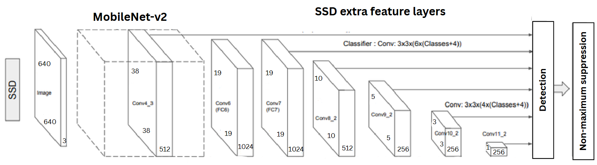
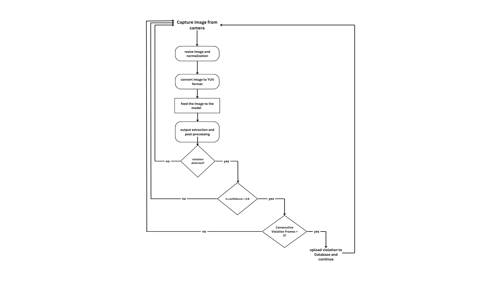
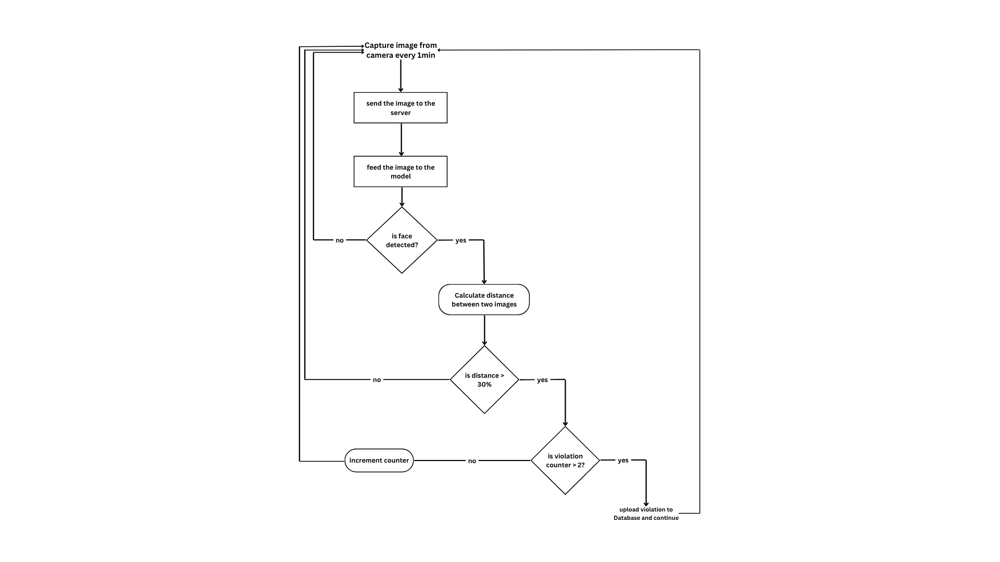
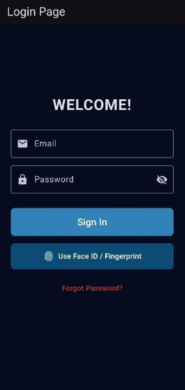
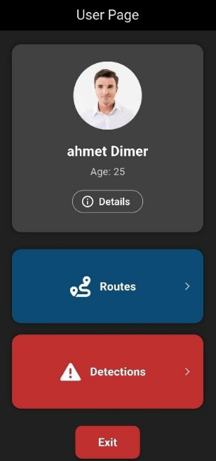
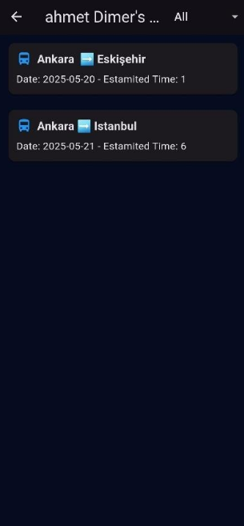
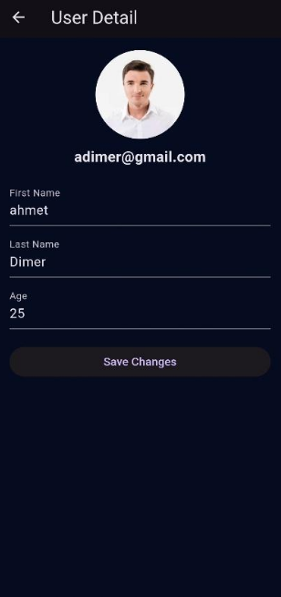
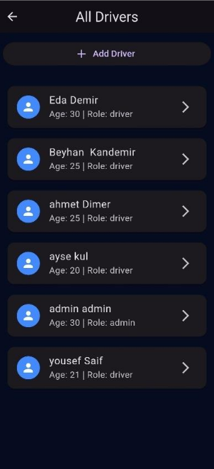
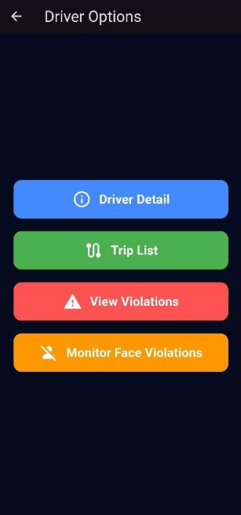

  

# GuardEye

GuardEye is a mobile-based AI system designed to improve road safety by monitoring and detecting risky driver behaviors in real-time. The system identifies actions such as smoking, phone usage, and vaping while driving, and verifies driver identity through facial recognition to prevent unauthorized access.

---

## Authors & Supervisor

- **Authors:** Yousef Saif & Beyhan Kandemir  
- **Supervisor:** Muhammed Fatih Demirci  

---

## Object Detection Model

We trained an **SSD MobileNet V2 FPNLite (640x640)** model, which balances high accuracy with low computational cost, making it suitable for real-time operation on mobile devices.

- **Dataset:** Custom dataset with over 14,000 labeled images  
- **Target Objects:** Cigarettes, vapes (electronic cigarettes), and mobile phones  
- **Functionality:** Detects risky behaviors in real-time and uploads violations automatically  

**Model Architecture:**  

**Workflow:**  

---

## Face Recognition Module

The system uses **face-api.js** for real-time driver verification.  
It continuously checks the current driver’s identity and compares it with the stored image to detect any mismatches or violations.

---

## Driver Page

The driver interface allows users to:  
- View upcoming and past trips  
- Access personal details  
- Check detected violations (view-only; no editing or deletion allowed)

**Screenshots:**  

  
  
  
  

---

## Admin Panel

The admin dashboard enables administrators to:  
- Add new drivers  
- Add or edit trips for all drivers  
- View and delete violations of drivers

**Screenshots:**  

  
  

---

## Technology Stack

- **Frontend:** Flutter (mobile application)  
- **Backend:** Firebase (Authentication, Realtime Database)  
- **Object Detection Model:** SSD MobileNet V2 FPNLite (640x640)  
- **Face Recognition:** Node.js + face-api.js  
- **Dataset:** Custom dataset with 14,000+ labeled images
